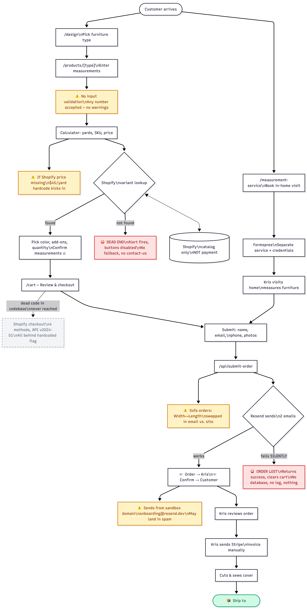

# Castaway Covers — Site Review

*A read-through before we sit down together*

Hey Kris — I went through the site and dug into the code with Claude to get a clear picture of how everything fits together. The short version: it's in good shape. People are finding it, configuring covers, and placing orders. Nothing here is a crisis.

What I wanted to do before we get on a call is write up what we found, so you have time to think about it on your own first. Some of this you'll already know. Some might be new. And a few things I genuinely don't know the answer to — you'll have better context than the code does.

The goal when we sit down isn't to overhaul anything. It's to make sure we understand what you've built, what you want it to become, and where a little attention now could save a headache later.

---

## Before We Talk

I'd love you to chew on these before we meet. No right answers — just want to hear what's on your mind so we're not starting from scratch when we sit down.

> **1.** What do you want the site to do for your business in the next year? More orders? Fewer headaches? New product types? Or just keep working the way it does, but smoother?
>
> **2.** Where do you spend the most time on stuff the site should be handling for you? Manually creating invoices, answering the same questions, chasing order details — anything that feels like busywork.
>
> **3.** What do customers get confused by or ask you about most? Measurement questions, pricing, how to order, what to expect after — whatever comes up again and again.
>
> **4.** Is the measurement service something you want to grow, or is it more of a convenience for local folks? Just trying to understand how central it is.
>
> **5.** Anything about the site that bugs you that you haven't had time to fix? Small stuff, big stuff — if it's been nagging you, I want to hear it.

---

## What We Noticed

Here's what stood out when we went through the site and the code. I've grouped things roughly by how much they matter — starting with the stuff that touches the core of the business, and working out toward cosmetic things at the end.

### Measurement Accuracy

This is where everything downstream depends. If the measurements going in are wrong, the cover coming out is wrong. So we looked here first.

**No guardrails on measurement inputs.** Right now a customer could type 0 or 999 into any field and the site won't flag it. We don't know if that's caused real problems — you would. Would a simple "that doesn't look right" warning help, or do most people get it right?

**The "Depth" label on chairs might be confusing.** It means seat depth — front to back — but some customers might measure the full chair depth including the backrest. Worth asking yourself: have you gotten orders where the depth seemed off?

**Sofa measurements get relabeled between the site and your email.** What the customer sees as "Width" on the product page arrives in your order email labeled "Length," and vice versa. The code does this intentionally to match how you think about it during production — but it's worth asking whether it's ever caused a mix-up.

### Order Reliability

Every order needs to get from the customer to you without dropping anything. There are two spots here worth knowing about.

**If the order email fails, the customer still sees a success message.** Their cart gets cleared, they think the order went through — but there's no backup anywhere. No database, no log file, nothing besides the email. If the email doesn't send, the order is just gone.

> **Worth knowing:** This is the most significant technical risk we found. The code catches email errors but reports success anyway, so there's no way to know it happened — not for you, not for the customer.

**Order emails come from a sandbox address, not castawaycovers.com.** They send from onboarding@resend.dev, which is a default testing address. That's the kind of thing that lands in spam — for you or your customers. Fixing it means verifying your domain in Resend and updating the sender. Straightforward, but it needs to be done.

### Customer Clarity

These are smaller things — none of them are blocking anyone — but they affect how polished the site feels.

**"Craftsmanship" in the nav, /features in the URL.** The page title says "Craftsmanship Details" but the URL is /features. It's a small inconsistency, but worth picking one name and using it everywhere.

**The order summary shows "Cover () x1 — $0.00" before a price is calculated.** The empty parentheses could look like something's broken rather than just waiting for input.

**The contact page "Send Message" button is blue.** Every other button on the site is teal. Minor visual inconsistency, but easy to fix when the time is right.

### Site Stability

These things work fine today, but could cause trouble if you or anyone else ever needs to make changes.

**There's a whole Shopify checkout system in the code that never runs.** You built it at some point and then switched to the manual checkout flow that's live now. The old code is still there — it's not hurting anything, but it would confuse anyone trying to work on the cart.

**If Shopify doesn't have a matching variant for a customer's measurements, they hit a dead end.** An alert fires, the buttons go gray, and there's no "contact us" fallback. Have you seen this happen? Might be worth adding a graceful off-ramp there.

### A Few Cleanup Items

Not customer-facing, but worth a quick mention.

Some internal naming is out of date — the code still calls the "Split Cover with Snaps" feature "magnets" everywhere, from back when it used magnets. Not a bug, just confusing for anyone reading the code later.

A few pages exist on the site that weren't documented anywhere — /account, /instructions, and /portfolio. We added them to the docs.

---

## The Full Picture

Below is a diagram of the complete path a customer takes from landing on the site to receiving a cover. We flagged the spots that caught our attention.

> **Yellow** = something we noticed — needs your confirmation on whether it's actually a problem
>
> **Red** = a failure mode where something breaks silently (no one knows)
>
> **Gray dashed** = dead code — exists in the codebase but never runs
>
> **Green** = the happy ending

---

## When We Sit Down

Here's how I'm thinking about using our time. Roughly an hour, give or take.

**Start with your vision (15-20 min).** We walk through your answers to the questions above. I'll take notes. The goal is to capture what you want the business and the site to do — in your words, not mine.

**Walk the diagram together (10 min).** We follow the customer path from top to bottom. At each yellow or red flag, you tell me: "yeah, that's been a problem" or "nah, that's fine." Your real-world experience is what turns these from guesses into priorities.

**Sort everything into buckets (15-20 min).** Based on what you care about and what the diagram surfaced, we decide what goes where:

- **Fix now** — things that could lose an order or confuse a customer today
- **Fix soon** — things that create extra manual work or could bite you later
- **Park it** — real observations but not worth spending time on right now

**Agree on next steps (5 min).** We land on what gets worked on first. I'll set up Claude with the priorities. If you can pull up some real orders you've filled, we can check the measurement formulas against actual production — that's how we make sure the math is right.

*Looking forward to it. Take your time with the questions.*
