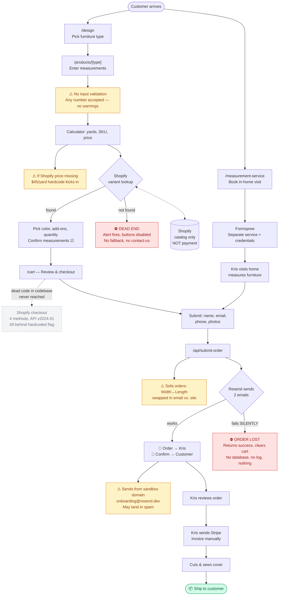

# Castaway Covers — System & Risk Map

**Legend**
- 🟡 Yellow = potential issue — needs Kris's confirmation
- 🔴 Red = failure mode with no recovery
- ⬜ Gray dashed = dead code (exists but never runs)
- 🟢 Green = happy ending
